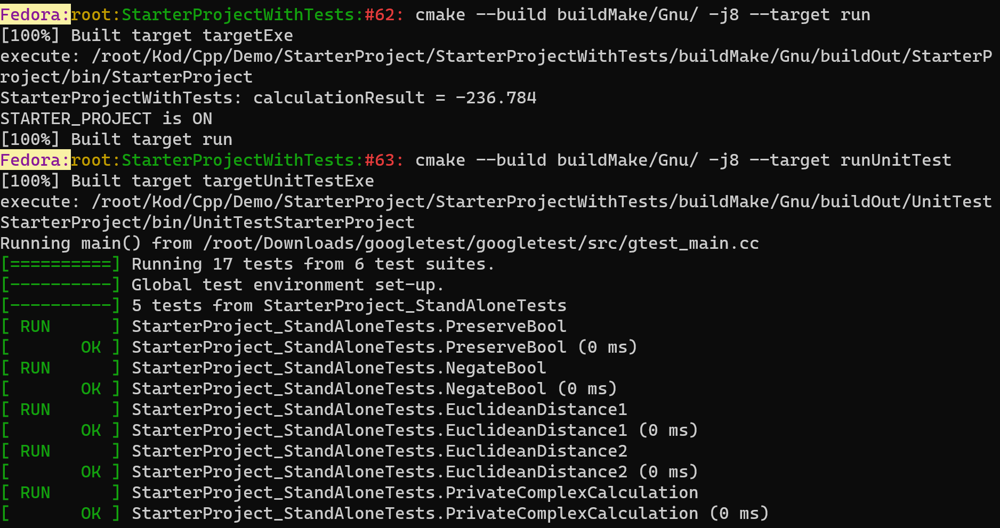
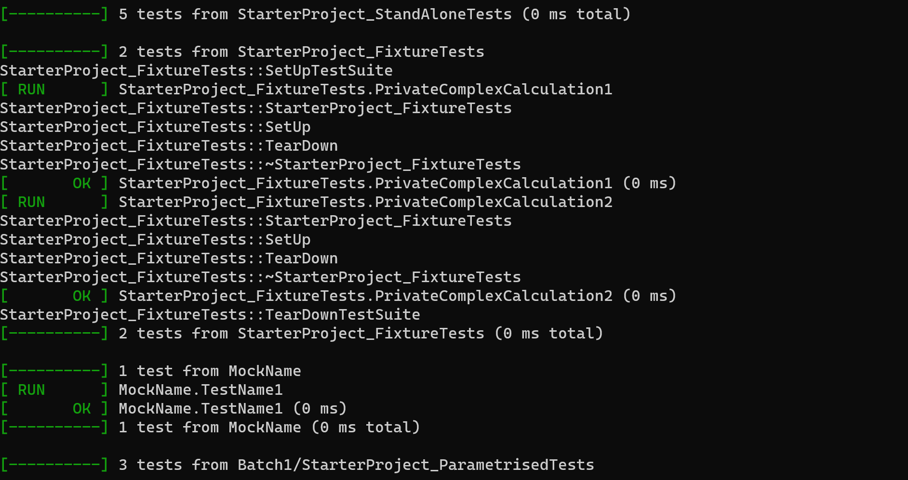
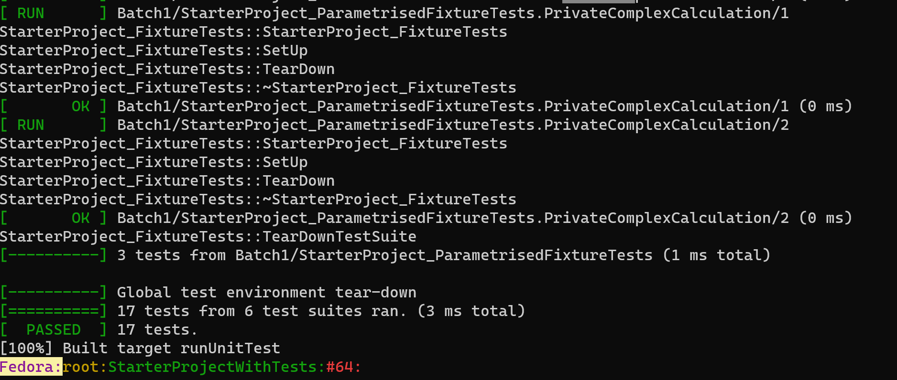
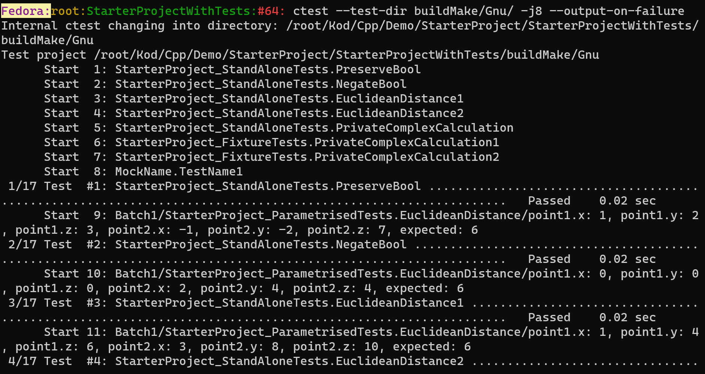
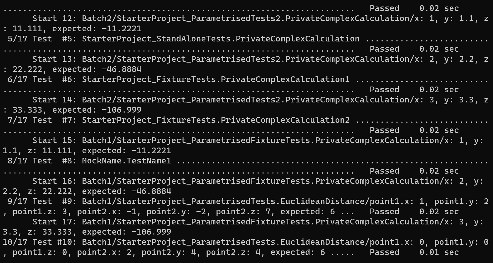
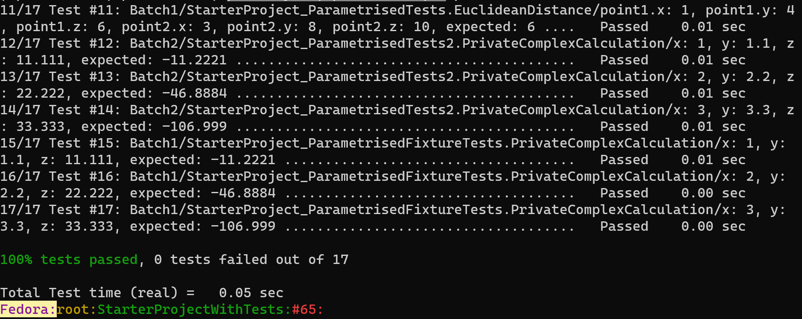

# Demo project with tests and mocks to get started with (modern) CMake, CMakePresets.json, CTest, GTest and GMock

This project should serve as a convenient starting template for coding more elaborate projects with tests and mocks. Stand-alone and parametrised tests, fixtures, and mocks are exemplified and can be easily extended. 

A noteworthy example provided here is the testing of a private method:

```
class Calculation final
{
public:
    void CalculateViaPrivateMethod(int x, float y, double z);

    ...

private:
    void PrivateMethodComplexCalculation(int x, float y, double z);
};
```

It turns out that with googletest it is easiest to test the private method indirectly, via it's public interface, i.e. via the public method `CalculateViaPrivateMethod` which calls the private method `PrivateMethodComplexCalculation` to be tested:
```
TEST(StarterProject_StandAloneTests, PrivateComplexCalculation)
{
    // ARRANGE
    Code::StarterProject::Calculation calculation;
    ...

    // ACT
    calculation.CalculateViaPrivateMethod(x, y, z);
    ...

    // ASSERT
    EXPECT_DOUBLE_EQ(expected, result) << "Failed: CalculateViaPrivateMethod(x, y, z)";
}
```
Direct testing of private methods is also possible but messy and not attempted here (it requires `friend`-ship between source and test and same namespaces for both).

For a simplest CMake with CMakePresets.json example but without tests/mocks, please refer to the demo
[CMakeStarterProjectNoTests](https://github.com/MariuszJozef/CMakeStarterProjectNoTests.git).

```
git clone --depth 1 https://github.com/MariuszJozef/CMakeStarterProjectWithTests.git
cd CMakeStarterProjectWithTests
```

```
.
├── CMakeLists.txt
├── CMakePresets.json
├── CMakeUtils
│   ├── FindOrFetch
│   │   └── FindOrFetchGTestGMock.cmake
│   ├── Handy
│   │   ├── DisallowInSourceBuilds.cmake
│   │   ├── DisplayGenericInfo.cmake
│   │   └── SelectCompilerViaFlagIfNotUsingCMakePresets.cmake
│   └── Presets
│       ├── BuildType.json
│       ├── Compilers.json
│       ├── Platforms.json
│       └── SingleConfigGenerators.json
├── Code
│   ├── CMakeLists.txt
│   └── StarterProject
│       ├── hdr
│       │   └── StarterProject.hpp
│       └── src
│           ├── MainStarterProject.cpp
│           └── StarterProject.cpp
├── Mock
│   ├── hdr
│   │   ├── IRealEntity.hpp
│   │   └── MockEntity.hpp
│   └── src
│       └── TestMockEntity.cpp
├── README.md
└── Tests
    ├── CMakeLists.txt
    └── UnitTestStarterProject
        ├── hdr
        │   ├── StarterProject_FixtureTests.hpp
        │   ├── StarterProject_ParametrisedFixtureTests.hpp
        │   └── StarterProject_ParametrisedTests.hpp
        └── src
            ├── StarterProject_FixtureTests.cpp
            ├── StarterProject_ParametrisedFixtureTests.cpp
            ├── StarterProject_ParametrisedTests.cpp
            └── StarterProject_StandAloneTests.cpp
```

## Running tests with CMake vs CTest

The program and tests can be executed either:
- by CMake itself via a flag appended to cmake build command: **--target run runUnitTest**
- or by CTest - but **make sure that the project is freshly built** because CTest doesn't rebuild any subsequent changes to the project.

GTest (arguably) provides nicer output of test results, but CTest can be useful when non-C++ code needs to be incorporated and tested, e.g. Python routines that are called by C++.

### Test output generated by CMake

```
cmake -S . -B buildMake/Gnu -G "Unix Makefiles" -D CMAKE_BUILD_TYPE=Debug -D setCompiler=gnu -D linkGTestAsSharedLibrary=OFF
cmake --build buildMake/Gnu/ -j8 --target run runUnitTest
```






### Test output generated by CTest

```
cmake -S . -B buildMake/Gnu -G "Unix Makefiles" -D CMAKE_BUILD_TYPE=Debug -D setCompiler=gnu -D linkGTestAsSharedLibrary=OFF
cmake --build buildMake/Gnu/ -j8 --target
ctest --test-dir buildMake/Gnu/ -j8 --output-on-failure
```





## Using CMake to link GTest/GMock on Linux/Mac vs on Windows - a big difference!

On Linux/Mac (and probably also on Unix), if googletest (which includes gmock) is installed on the users computer, then one should locate the file *GTestConfig.cmake* and provide its path at the CMake configure step via the flag: `-D GTest_DIR=/path/to/GTestConfig.cmake/`.

Alternatively, the variable GTest_DIR has been assigned a hardcoded path in the file:
[./CMakeUtils/FindOrFetch/FindOrFetchGTestGMock.cmake](./CMakeUtils/FindOrFetch/FindOrFetchGTestGMock.cmake),
it may be adjusted there to the users proper path. 

If GTest is not installed or not found, then CMake will fetch GTest source code from its remote repository and build it with this project. So actually there isn't a big deal with GTest_DIR.

One may also set the flag `linkGTestAsSharedLibrary` to `ON` or `OFF` to indicate whether to link gtest/gmock as a static or a shared library. If omitted it will default to OFF and gtest will be linked as a static library.

So a full CMake configure command to may look like this:
```
cmake -S . -B buildMake/Gnu -G "Unix Makefiles" -D CMAKE_BUILD_TYPE=Debug -D setCompiler=gnu -D linkGTestAsSharedLibrary=<ON/OFF> -D GTest_DIR=/path/to/GTestConfig.cmake/
```

On Windows, the only trouble-free way to link gtest/gmock is not to bother with any preinstalled gtest library on the computer, but for each project to fetch it directly from remote repository and build it together with a current project in question. This will result in multiple copies of gtest source code, but (on Windows) only this approach guarantees no compilation/linking errors. So on Windows the flag GTest_DIR is superfluous, but may be carried along without harm.

## Generic commands to run tests *without* CMakePresets.json

### Single-config generator
```
cmake -S <sourceDir> -B <buildDir> -G <single-config generator> -D CMAKE_BUILD_TYPE=<buildType>
cmake --build <buildDir> -j <number of CPU cores> --target run runUnitTest

OR using CTest instead:

cmake -S <sourceDir> -B <buildDir> -G <single-config generator> -D CMAKE_BUILD_TYPE=<buildType>
cmake --build <buildDir> -j <number of CPU cores>
ctest --test-dir <buildDir> -j <number of CPU cores> --output-on-failure
```
### Multi-config generator
```
cmake -S <sourceDir> -B <buildDir> -G <multi-config generator>
cmake --build <buildDir> --config <buildType> -j <number of CPU cores> --target run runUnitTest

OR using CTest instead:

cmake -S <sourceDir> -B <buildDir> -G <multi-config generator>
cmake --build <buildDir> --config <buildType> -j <number of CPU cores>
ctest --test-dir <buildDir> --config <buildType> -j <number of CPU cores> --output-on-failure
```
## Generic commands to run tests *with* CMakePresets.json
### Single-config generator
```
cmake --preset <single-config presetName>
cmake --build --preset <single-config presetName> --target run runUnitTest

OR using CTest instead:

cmake --preset <single-config presetName>
cmake --build --preset <single-config presetName>
ctest --preset <single-config presetName> --output-on-failure
```

### Multi-config generator
```
cmake --preset <multi-config presetName>
cmake --build --preset <multi-config presetName> --config <buildType> --target run runUnitTest

OR using CTest instead:

cmake --preset <multi-config presetName>
cmake --build --preset <multi-config presetName> --config <buildType>
ctest --preset <multi-config presetName> --config <buildType> --output-on-failure
```
Concrete command examples follow (not exhaustive), only one set from the below is needed, choose whichever suits. The flag `-D linkGTestAsSharedLibrary=<ON/OFF>` should be set to either ON or OFF; if omitted it will default to OFF and gtest will be linked as a static library instead of as a shared library.

**N.B.**

- On Windows 11 it is preferable to issue the commands from **"Developer Command Prompt for VS 2022"** instead of regular PowerShell or CMD because the former has predefined Visual Studio environment variables which enable compilation with VS compiler.
- If nevertheless using PowerShell/CMD, or on Windows 10, one must first run some appropriate *.bat scripts that define VS environment variables.

## Example commands to configure, build, and run the program unit tests *without* CMakePresets.json

### Ninja single-config, VS (cl.exe) compiler
```
cmake -S . -B buildNinja/Msvc -G Ninja -D linkGTestAsSharedLibrary=<ON/OFF> -D setCompiler=msvc -D CMAKE_BUILD_TYPE=Debug
cmake --build buildNinja/Msvc -j8 --target run runUnitTest
ctest --test-dir buildNinja/Msvc -j8 --output-on-failure -D CMAKE_BUILD_TYPE=Debug

OR

cmake -S . -B buildNinja/Msvc -G Ninja -D linkGTestAsSharedLibrary=<ON/OFF> -D setCompiler=msvc -D CMAKE_BUILD_TYPE=Release
cmake --build buildNinja/Msvc -j8 --target run runUnitTest
ctest --test-dir buildNinja/Msvc -j8 --output-on-failure -D CMAKE_BUILD_TYPE=Release

OR

cmake -S . -B buildNinja/Msvc -G Ninja -D linkGTestAsSharedLibrary=<ON/OFF> -D setCompiler=msvc -D CMAKE_BUILD_TYPE=RelWithDebInfo
cmake --build buildNinja/Msvc -j8 --target run runUnitTest
ctest --test-dir buildNinja/Msvc -j8 --output-on-failure -D CMAKE_BUILD_TYPE=RelWithDebInfo

OR

cmake -S . -B buildNinja/Msvc -G Ninja -D linkGTestAsSharedLibrary=<ON/OFF> -D setCompiler=msvc -D CMAKE_BUILD_TYPE=MinSizeRel
cmake --build buildNinja/Msvc -j8 --target run runUnitTest
ctest --test-dir buildNinja/Msvc -j8 --output-on-failure -D CMAKE_BUILD_TYPE=MinSizeRel
```

### Ninja single-config, GNU (gcc, g++) compiler
```
cmake -S . -B buildNinja/Gnu -G Ninja -D linkGTestAsSharedLibrary=<ON/OFF> -D setCompiler=gnu -D CMAKE_BUILD_TYPE=Debug
cmake --build buildNinja/Gnu -j8 --target run runUnitTest
ctest --test-dir buildNinja/Gnu -j8 --output-on-failure -D CMAKE_BUILD_TYPE=Debug

OR

cmake -S . -B buildNinja/Gnu -G Ninja -D linkGTestAsSharedLibrary=<ON/OFF> -D setCompiler=gnu -D CMAKE_BUILD_TYPE=Release
cmake --build buildNinja/Gnu -j8 --target run runUnitTest
ctest --test-dir buildNinja/Gnu -j8 --output-on-failure -D CMAKE_BUILD_TYPE=Release

OR

cmake -S . -B buildNinja/Gnu -G Ninja -D linkGTestAsSharedLibrary=<ON/OFF> -D setCompiler=gnu -D CMAKE_BUILD_TYPE=RelWithDebInfo
cmake --build buildNinja/Gnu -j8 --target run runUnitTest
ctest --test-dir buildNinja/Gnu -j8 --output-on-failure -D CMAKE_BUILD_TYPE=RelWithDebInfo

OR

cmake -S . -B buildNinja/Gnu -G Ninja -D linkGTestAsSharedLibrary=<ON/OFF> -D setCompiler=gnu -D CMAKE_BUILD_TYPE=MinSizeRel
cmake --build buildNinja/Gnu -j8 --target run runUnitTest
ctest --test-dir buildNinja/Gnu -j8 --output-on-failure -D CMAKE_BUILD_TYPE=MinSizeRel
```

### Ninja single-config, Clang (clang, clang++) compiler
```
cmake -S . -B buildNinja/Clang -G Ninja -D linkGTestAsSharedLibrary=<ON/OFF> -D setCompiler=clang -D CMAKE_BUILD_TYPE=Debug
cmake --build buildNinja/Clang -j8 --target run runUnitTest
ctest --test-dir buildNinja/Clang -j8 --output-on-failure -D CMAKE_BUILD_TYPE=Debug

OR

cmake -S . -B buildNinja/Clang -G Ninja -D linkGTestAsSharedLibrary=<ON/OFF> -D setCompiler=clang -D CMAKE_BUILD_TYPE=Release
cmake --build buildNinja/Clang -j8 --target run runUnitTest
ctest --test-dir buildNinja/Clang -j8 --output-on-failure -D CMAKE_BUILD_TYPE=Release

OR

cmake -S . -B buildNinja/Clang -G Ninja -D linkGTestAsSharedLibrary=<ON/OFF> -D setCompiler=clang -D CMAKE_BUILD_TYPE=RelWithDebInfo
cmake --build buildNinja/Clang -j8 --target run runUnitTest
ctest --test-dir buildNinja/Clang -j8 --output-on-failure -D CMAKE_BUILD_TYPE=RelWithDebInfo

OR

cmake -S . -B buildNinja/Clang -G Ninja -D linkGTestAsSharedLibrary=<ON/OFF> -D setCompiler=clang -D CMAKE_BUILD_TYPE=MinSizeRel
cmake --build buildNinja/Clang -j8 --target run runUnitTest
ctest --test-dir buildNinja/Clang -j8 --output-on-failure -D CMAKE_BUILD_TYPE=MinSizeRel
```

### Ninja multi-config, VS (cl.exe) compiler
```
cmake -S . -B buildNinjaMC/Msvc -G "Ninja Multi-Config" -D linkGTestAsSharedLibrary=<ON/OFF> -D setCompiler=msvc
cmake --build buildNinjaMC/Msvc -j8 --config Debug --target run runUnitTest
ctest --test-dir buildNinjaMC/Msvc -j8 --config Debug --output-on-failure

OR

cmake -S . -B buildNinjaMC/Msvc -G "Ninja Multi-Config" -D linkGTestAsSharedLibrary=<ON/OFF> -D setCompiler=msvc
cmake --build buildNinjaMC/Msvc -j8 --config Release --target run runUnitTest
ctest --test-dir buildNinjaMC/Msvc -j8 --config Release --output-on-failure

OR

cmake -S . -B buildNinjaMC/Msvc -G "Ninja Multi-Config" -D linkGTestAsSharedLibrary=<ON/OFF> -D setCompiler=msvc
cmake --build buildNinjaMC/Msvc -j8 --config RelWithDebInfo --target run runUnitTest
ctest --test-dir buildNinjaMC/Msvc -j8 --config RelWithDebInfo --output-on-failure

OR

cmake -S . -B buildNinjaMC/Msvc -G "Ninja Multi-Config" -D linkGTestAsSharedLibrary=<ON/OFF> -D setCompiler=msvc
cmake --build buildNinjaMC/Msvc -j8 --config MinSizeRel --target run runUnitTest
ctest --test-dir buildNinjaMC/Msvc -j8 --config MinSizeRel --output-on-failure
```

### Ninja multi-config, GNU (gcc, g++) compiler
```
cmake -S . -B buildNinjaMC/Gnu -G "Ninja Multi-Config" -D linkGTestAsSharedLibrary=<ON/OFF> -D setCompiler=gnu
cmake --build buildNinjaMC/Gnu -j8 --config Debug --target run runUnitTest
ctest --test-dir buildNinjaMC/Gnu -j8 --config Debug --output-on-failure

OR

cmake -S . -B buildNinjaMC/Gnu -G "Ninja Multi-Config" -D linkGTestAsSharedLibrary=<ON/OFF> -D setCompiler=gnu
cmake --build buildNinjaMC/Gnu -j8 --config Release --target run runUnitTest
ctest --test-dir buildNinjaMC/Gnu -j8 --config Release --output-on-failure

OR

cmake -S . -B buildNinjaMC/Gnu -G "Ninja Multi-Config" -D linkGTestAsSharedLibrary=<ON/OFF> -D setCompiler=gnu
cmake --build buildNinjaMC/Gnu -j8 --config RelWithDebInfo --target run runUnitTest
ctest --test-dir buildNinjaMC/Gnu -j8 --config RelWithDebInfo --output-on-failure

OR

cmake -S . -B buildNinjaMC/Gnu -G "Ninja Multi-Config" -D linkGTestAsSharedLibrary=<ON/OFF> -D setCompiler=gnu
cmake --build buildNinjaMC/Gnu -j8 --config MinSizeRel --target run runUnitTest
ctest --test-dir buildNinjaMC/Gnu -j8 --config MinSizeRel --output-on-failure
```

### Ninja multi-config, Clang (clang, clang++) compiler
```
cmake -S . -B buildNinjaMC/Clang -G "Ninja Multi-Config" -D linkGTestAsSharedLibrary=<ON/OFF> -D setCompiler=clang
cmake --build buildNinjaMC/Clang -j8 --config Debug --target run runUnitTest
ctest --test-dir buildNinjaMC/Clang -j8 --config Debug --output-on-failure

OR

cmake -S . -B buildNinjaMC/Clang -G "Ninja Multi-Config" -D linkGTestAsSharedLibrary=<ON/OFF> -D setCompiler=clang
cmake --build buildNinjaMC/Clang -j8 --config Release --target run runUnitTest
ctest --test-dir buildNinjaMC/Clang -j8 --config Release --output-on-failure

OR

cmake -S . -B buildNinjaMC/Clang -G "Ninja Multi-Config" -D linkGTestAsSharedLibrary=<ON/OFF> -D setCompiler=clang
cmake --build buildNinjaMC/Clang -j8 --config RelWithDebInfo --target run runUnitTest
ctest --test-dir buildNinjaMC/Clang -j8 --config RelWithDebInfo --output-on-failure

OR

cmake -S . -B buildNinjaMC/Clang -G "Ninja Multi-Config" -D linkGTestAsSharedLibrary=<ON/OFF> -D setCompiler=clang
cmake --build buildNinjaMC/Clang -j8 --config MinSizeRel --target run runUnitTest
ctest --test-dir buildNinjaMC/Clang -j8 --config MinSizeRel --output-on-failure
```

## Example commands to configure, build, and run the program unit tests *with* CMakePresets.json

### Ninja single-config, VS (cl.exe) compiler
```
cmake --preset Ninja-Msvc-Debug -D linkGTestAsSharedLibrary=<ON/OFF>
cmake --build --preset Ninja-Msvc-Debug --target run runUnitTest
ctest --preset Ninja-Msvc-Debug --output-on-failure

OR

cmake --preset Ninja-Msvc-Release -D linkGTestAsSharedLibrary=<ON/OFF>
cmake --build --preset Ninja-Msvc-Release --target run runUnitTest
ctest --preset Ninja-Msvc-Release --output-on-failure

OR

cmake --preset Ninja-Msvc-RelWithDebInfo -D linkGTestAsSharedLibrary=<ON/OFF>
cmake --build --preset Ninja-Msvc-RelWithDebInfo --target run runUnitTest
ctest --preset Ninja-Msvc-RelWithDebInfo --output-on-failure

OR

cmake --preset Ninja-Msvc-MinSizeRel -D linkGTestAsSharedLibrary=<ON/OFF>
cmake --build --preset Ninja-Msvc-MinSizeRel --target run runUnitTest
ctest --preset Ninja-Msvc-MinSizeRel --output-on-failure
```

### Ninja single-config, GNU (gcc, g++) compiler
```
cmake --preset Ninja-Gnu-Debug -D linkGTestAsSharedLibrary=<ON/OFF>
cmake --build --preset Ninja-Gnu-Debug --target run runUnitTest
ctest --preset Ninja-Gnu-Debug --output-on-failure

OR

cmake --preset Ninja-Gnu-Release -D linkGTestAsSharedLibrary=<ON/OFF>
cmake --build --preset Ninja-Gnu-Release --target run runUnitTest
ctest --preset Ninja-Gnu-Release --output-on-failure

OR

cmake --preset Ninja-Gnu-RelWithDebInfo -D linkGTestAsSharedLibrary=<ON/OFF>
cmake --build --preset Ninja-Gnu-RelWithDebInfo --target run runUnitTest
ctest --preset Ninja-Gnu-RelWithDebInfo --output-on-failure

OR

cmake --preset Ninja-Gnu-MinSizeRel -D linkGTestAsSharedLibrary=<ON/OFF>
cmake --build --preset Ninja-Gnu-MinSizeRel --target run runUnitTest
ctest --preset Ninja-Gnu-MinSizeRel --output-on-failure
```

### Ninja single-config, Clang (clang, clang++) compiler
```
cmake --preset Ninja-Clang-Debug -D linkGTestAsSharedLibrary=<ON/OFF>
cmake --build --preset Ninja-Clang-Debug --target run runUnitTest
ctest --preset Ninja-Clang-Debug --output-on-failure

OR

cmake --preset Ninja-Clang-Release -D linkGTestAsSharedLibrary=<ON/OFF>
cmake --build --preset Ninja-Clang-Release --target run runUnitTest
ctest --preset Ninja-Clang-Release --output-on-failure

OR

cmake --preset Ninja-Clang-RelWithDebInfo -D linkGTestAsSharedLibrary=<ON/OFF>
cmake --build --preset Ninja-Clang-RelWithDebInfo --target run runUnitTest
ctest --preset Ninja-Clang-RelWithDebInfo --output-on-failure

OR

cmake --preset Ninja-Clang-MinSizeRel -D linkGTestAsSharedLibrary=<ON/OFF>
cmake --build --preset Ninja-Clang-MinSizeRel --target run runUnitTest
ctest --preset Ninja-Clang-MinSizeRel --output-on-failure
```

### Ninja multi-config, VS (cl.exe) compiler
```
cmake --preset NinjaMC-Msvc -D linkGTestAsSharedLibrary=<ON/OFF>

cmake --build --preset NinjaMC-Msvc --config Debug --target run runUnitTest
cmake --build --preset NinjaMC-Msvc --config Release --target run runUnitTest
cmake --build --preset NinjaMC-Msvc --config RelWithDebInfo --target run runUnitTest

ctest --preset NinjaMC-Msvc --config Debug --output-on-failure
ctest --preset NinjaMC-Msvc --config Release --output-on-failure
ctest --preset NinjaMC-Msvc --config RelWithDebInfo --output-on-failure
```

### Ninja multi-config, GNU (gcc, g++) compiler
```
cmake --preset NinjaMC-Gnu -D linkGTestAsSharedLibrary=<ON/OFF>

cmake --build --preset NinjaMC-Gnu --config Debug --target run runUnitTest
cmake --build --preset NinjaMC-Gnu --config Release --target run runUnitTest
cmake --build --preset NinjaMC-Gnu --config RelWithDebInfo --target run runUnitTest

ctest --preset NinjaMC-Gnu --config Debug --output-on-failure
ctest --preset NinjaMC-Gnu --config Release --output-on-failure
ctest --preset NinjaMC-Gnu --config RelWithDebInfo --output-on-failure
```

### Ninja multi-config, Clang (clang, clang++) compiler
```
cmake --preset NinjaMC-Clang -D linkGTestAsSharedLibrary=<ON/OFF>

cmake --build --preset NinjaMC-Clang --config Debug --target run runUnitTest
cmake --build --preset NinjaMC-Clang --config Release --target run runUnitTest
cmake --build --preset NinjaMC-Clang --config RelWithDebInfo --target run runUnitTest

ctest --preset NinjaMC-Clang --config Debug --output-on-failure
ctest --preset NinjaMC-Clang --config Release --output-on-failure
ctest --preset NinjaMC-Clang --config RelWithDebInfo --output-on-failure
```
